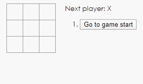

# use-react
> use react tonight!

## Main concepts

- [`JSX` 和 `React elements`](https://github.com/pluscai/use-react/issues/2)
- [Render`element`to`DOM` （做最少的`DOM`操作）](https://github.com/pluscai/use-react/issues/3)
- [Components make life easier（组件复用让生活更美好）](https://github.com/pluscai/use-react/issues/4)
- [State and Lifecycle（组件如何响应数据的变化）](https://github.com/pluscai/use-react/issues/5)

- [掌握React的基本使用，重塑前端开发](https://github.com/pluscai/use-react/issues/13)

## `tic-tac-toe game`井字棋游戏

> 效果：

[项目地址链接](https://github.com/pluscai/tic-tac-toe-game)